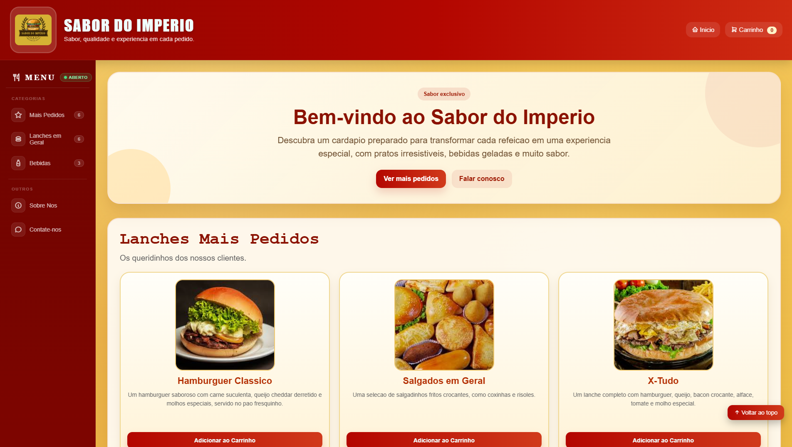

<div align="center">

  <h1>🍔 Sabor do Império</h1>

  <p>
    
    
    
    
  </p>

  <p>
    Site de delivery desenvolvido do zero, com cardápio interativo,<br>
    carrinho de compras e formulário de contato.
  </p>

</div>

---

## 🖥️ Sobre o Projeto

O **Sabor do Império** é um site de delivery focado em oferecer uma experiência agradável ao cliente, com um cardápio bem organizado, navegação intuitiva e design responsivo.

---

## 📸 Preview

<div align="center">
  
</div>

---

## 🎬 Demonstração

<div align="center">
  <a href="video_demonstracao/demonstracao.mp4">
    
  </a>
  <p><em>▶️ Clique na imagem para assistir a demonstração</em></p>
</div>

---

## ✨ Funcionalidades

- 🍔 Cardápio com categorias (Lanches Mais Pedidos, Lanches em Geral e Bebidas)
- 🛒 Carrinho de compras com controle de quantidade
- 🔍 Modal de detalhes do produto
- 📱 Layout responsivo para mobile e desktop
- 📩 Formulário de contato
- ⬆️ Botão de voltar ao topo

---

## 📂 Estrutura do Projeto

```
📦 imperio-food-system
 ┣ 📁 img                          → Imagens do site
 ┣ 📁 video_demonstracao           → Demonstração do site
 ┃ ┣ 📄 demonstracao.mp4
 ┃ ┗ 📄 foto.png
 ┣ 📄 index.html                   → Página principal
 ┣ 📄 lanches.html                 → Página de lanches
 ┣ 📄 bebidas.html                 → Página de bebidas
 ┣ 📄 carrinho.html                → Página do carrinho
 ┣ 📄 estilo.css                   → Estilos da página principal
 ┣ 📄 estilo2.css                  → Estilos do carrinho
 ┗ 📄 script.js                    → Lógica do carrinho e interações
```

---

<div align="center">
  <p>⭐ Caso queira acompanhar mais projetos, visite meu perfil no GitHub!</p>
</div>